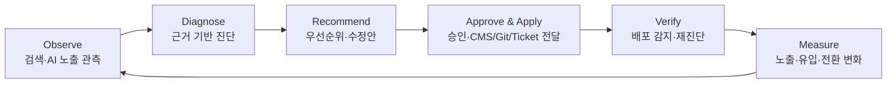
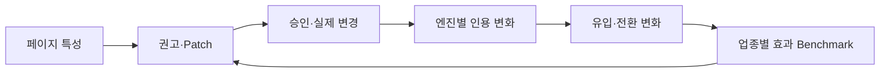
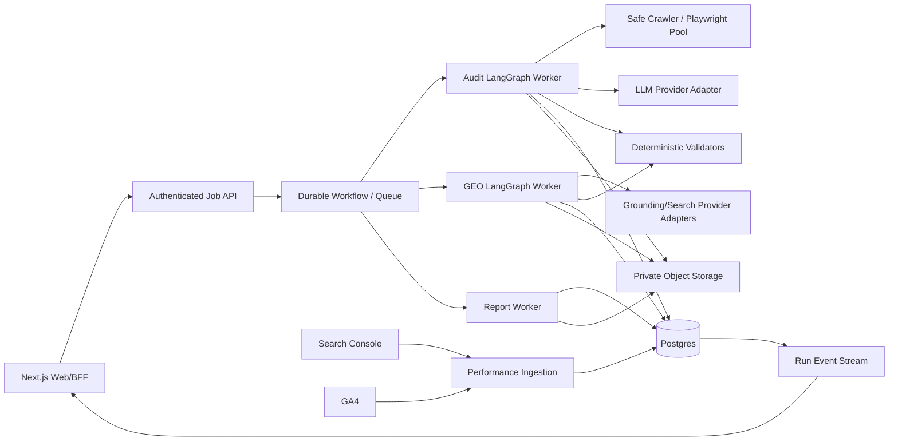
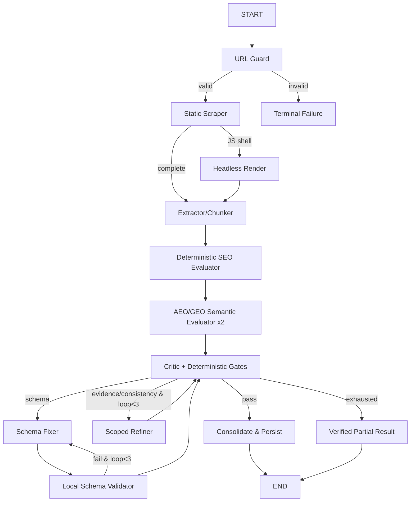
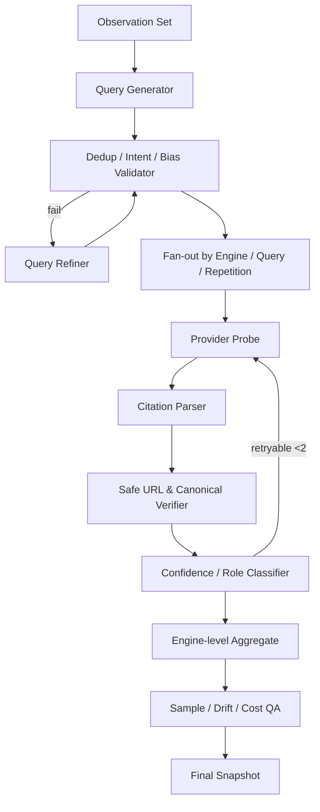
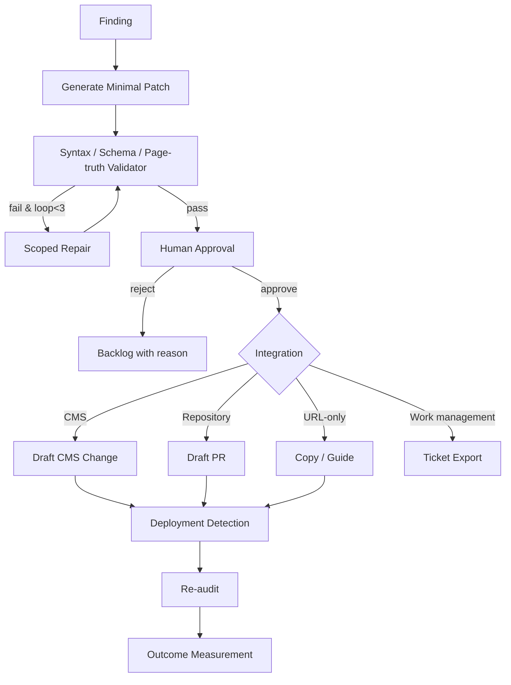
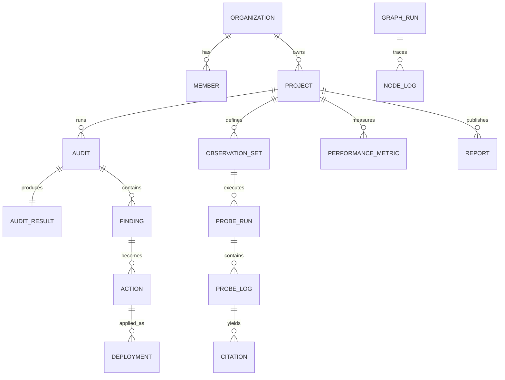

# CiteGraph 최종 통합 기획서 v2.0

> Graph Engineering 기반 SEO · AEO · GEO Intelligence & Execution Platform  
> 문서 상태: 사업·제품·UX·데이터·백엔드·시장 검증 통합본  
> 작성 기준일: 2026-08-18  
> 대상 독자: 경영진, PM, 마케팅/SEO 조직, 개발팀, 데이터/AI 엔지니어, 투자·사업 검토자

---

## 0. 문서의 결론

CiteGraph는 URL 점수를 보여주는 또 하나의 SEO 도구가 아니다. **브랜드가 검색과 생성형 답변에서 발견되고, 답변으로 추출되며, 신뢰 가능한 출처로 인용되도록 진단·수정·관측·성과 측정을 하나의 폐쇄 루프(closed loop)로 운영하는 B2B SaaS**다.

초기 시장은 모든 마케터가 아니라 **다수 고객에게 SEO·콘텐츠·GEO 분석 보고서를 납품하는 대행사와 전문 컨설턴트**로 좁힌다. 첫 번째 유료 가치는 “완벽한 범용 AI 검색 점유율”이 아니라 다음 세 가지다.

1. 고객 사이트의 SEO/AEO/GEO 문제를 근거와 함께 재현 가능하게 진단한다.
2. 실제 적용 가능한 콘텐츠·HTML·JSON-LD 수정안과 검증 결과를 제공한다.
3. Gemini 중심의 초기 관측에서 시작해 다중 엔진의 인용 변화와 작업 성과를 화이트라벨 보고서로 자동 발행한다.

제품의 핵심 루프는 다음과 같다.



### 0.1 기존 기획 대비 핵심 고도화

| 영역 | 기존 접근 | v2.0 고도화 |
|---|---|---|
| 타깃 | 마케터·대행사·개발자 동시 공략 | 대행사 우선 ICP, 이후 인하우스 확장 |
| 가치 | 통합 점수와 보고서 | 진단→수정→배포→재관측→성과 귀속 |
| GEO | 5개 질의 기반 Gemini probe | 다중 엔진·의도별 변형·반복 표본·관측 조건 통제 |
| KPI | 점수 및 인용률 | 가시성·권위·유입·전환·실행률 |
| 수정 | 코드 복사 | 승인, CMS/Git/Ticket export, 배포 감지, 재진단 |
| 사업성 | 기능 중심 | 가격, 원가, 사용량 credit, 시장 가설과 검증 게이트 |
| 방어력 | 그래프 기술 | 장기 인용 관측·수정 전후 효과·업종 benchmark 데이터 |
| 운영 | retry/RLS 중심 | queue lease, zombie recovery, prompt injection, lifecycle |

---

# 1. 제품 전략과 시장 정의

## 1.1 해결할 문제

검색 경험이 링크 목록에서 합성 답변으로 확장되면서 기업은 세 가지를 동시에 관리해야 한다.

- 검색엔진이 페이지를 올바르게 발견하고 이해하는가(SEO)
- 답변 엔진이 명확한 직답 단위로 추출할 수 있는가(AEO)
- 생성형 검색이 해당 페이지를 신뢰 가능한 출처로 실제 인용하는가(GEO)

기존 도구의 공백은 다음과 같다.

1. 기술 SEO 도구는 생성형 인용 가능성을 충분히 설명하지 못한다.
2. LLM 기반 분석기는 점수와 근거가 실행마다 흔들린다.
3. GEO 모니터링은 공급자·지역·표본에 따라 결과가 달라 절대 순위처럼 보기 어렵다.
4. 분석 결과가 실제 CMS·코드·업무로 전달되지 않아 실행률이 낮다.
5. 점수 개선이 유입·리드·매출에 기여했는지 연결하기 어렵다.

## 1.2 제품 비전과 포지셔닝

> **검색과 AI 답변의 가시성을 관측하고, 검증된 수정안을 실행하며, 실제 성과까지 연결하는 Evidence-first Optimization Platform.**

### 초기 포지셔닝

> SEO·콘텐츠 대행사가 고객 사이트의 AI 검색 가시성을 검증하고, 실행 가능한 개선안과 화이트라벨 보고서를 반복 납품하도록 돕는 플랫폼.

### 확장 포지셔닝

- Phase 1: Agency GEO Audit & Reporting
- Phase 2: Multi-engine Visibility Operations
- Phase 3: CMS/Git Execution Workflow
- Phase 4: Visibility-to-Revenue Attribution & Benchmark Intelligence

## 1.3 ICP와 구매 구조

### Primary ICP — SEO·콘텐츠·디지털 대행사

| 항목 | 정의 |
|---|---|
| 규모 | 고객사 5~100개, 실무자 3~50명 |
| 구매자 | 대표, 사업총괄, SEO/GEO 서비스 책임자 |
| 사용자 | SEO 컨설턴트, 콘텐츠 전략가, AE, 개발 협업자 |
| 반복 과업 | 진단, 개선안 작성, 월간 보고, 경쟁사 비교 |
| 구매 동기 | 신규 GEO 서비스 상품화, 보고서 시간 단축, 차별화 |
| 지불 의사 신호 | 화이트라벨, 다중 프로젝트, 자동 보고, 고객 포털 요구 |

### Secondary ICP — 검색 의존도가 높은 인하우스 팀

- SaaS, 이커머스, 금융, 의료, 교육, 여행처럼 설명·비교·추천 질의의 가치가 큰 조직
- 콘텐츠 100개 이상 또는 월 10개 이상 신규 발행
- 마케팅과 개발 조직이 분리돼 수정 전달 비용이 큰 팀

### 초기 비타깃

- 단 한 개의 소규모 랜딩 페이지만 운영하는 사업자
- 검색 유입의 사업 가치가 낮은 조직
- 인용·검색 노출 보장을 요구하는 고객
- 검증되지 않은 자동 콘텐츠 대량 생성을 주목적으로 하는 고객

## 1.4 JTBD

| 역할 | When | I want to | So I can |
|---|---|---|---|
| 대행사 책임자 | GEO 서비스를 판매할 때 | 신뢰 가능한 표준 진단과 보고서를 만들고 싶다 | 납품 원가를 낮추고 신규 매출을 만든다 |
| 컨설턴트 | 고객 사이트를 분석할 때 | 근거·우선순위·수정안을 함께 얻고 싶다 | 반복 조사 시간을 줄인다 |
| 콘텐츠 팀 | 문서를 개선할 때 | 어떤 문장이 답변·인용에 불리한지 알고 싶다 | 수정 방향을 구체화한다 |
| 개발자 | 개선 요청을 받을 때 | 실제 위치와 검증 기준이 있는 patch를 받고 싶다 | 모호한 커뮤니케이션을 줄인다 |
| 임원 | 예산을 검토할 때 | 가시성 변화가 유입·전환과 연결됐는지 보고 싶다 | 투자 효과를 판단한다 |

## 1.5 제품 원칙

1. **Evidence before score**: 점수보다 관측값과 원문 근거를 먼저 보존한다.
2. **Readiness is not visibility**: 인용 준비도와 실제 인용은 절대 합치지 않는다.
3. **Observation is conditional**: GEO 결과에는 엔진·지역·언어·시점·표본 수를 표시한다.
4. **Human-approved execution**: 콘텐츠 사실과 배포는 기본적으로 사람의 승인을 거친다.
5. **Deterministic gates around probabilistic models**: LLM 전후에 규칙 기반 검증을 둔다.
6. **Partial truth over confident failure**: 불완전한 결과는 N/A와 실패 이유로 표시한다.
7. **Outcome over vanity score**: 최종 가치는 점수보다 실행·노출·유입·전환 변화다.

---

# 2. 사업 모델과 시장 검증

## 2.1 핵심 사업 가설

| ID | 가설 | 검증 방법 | 성공 기준 | 실패 시 대응 |
|---|---|---|---|---|
| H1 | 대행사는 GEO 보고 자동화에 비용을 지불한다 | 15개 대행사 인터뷰 + 5개 유료 파일럿 | 3개 이상 유료 전환 | 인하우스 콘텐츠 팀으로 ICP 전환 |
| H2 | 보고서 시간이 핵심 pain이다 | 기존/도구 사용 시간 측정 | 보고서당 60% 이상 절감 | 진단보다 workflow 가치 강화 |
| H3 | Gemini 단일 엔진도 초기 구매 가치가 있다 | 단일 엔진 MVP 가격 테스트 | 파일럿 40% 이상 구매 의향 | 2번째 엔진 조기 추가 |
| H4 | 실행 가능한 patch가 재사용을 만든다 | patch 사용·재진단 추적 | audit의 30% 이상 patch 승인 | CMS/Git 연동 우선순위 재검토 |
| H5 | 고객은 월간 관측 credit 과금을 수용한다 | 3개 가격 패키지 테스트 | 가격 반대보다 한도 조정 요구 우세 | seat+project 과금으로 단순화 |

## 2.2 MVP 검증 순서

### Problem Interview

- 최근 고객 보고서 하나를 만드는 데 걸린 시간
- GEO 분석을 현재 어떤 방식으로 납품하는지
- 고객이 분석 근거에 이의를 제기한 사례
- 실제 수정 반영까지 누가 어떤 도구를 사용하는지
- 어떤 데이터가 있어야 월 구독을 승인하는지

### Concierge Pilot

제품 자동화 전에 5개 대행사·각 2개 고객 URL을 수동/반자동 분석한다. 실제 납품 과정에서 사용된 섹션, 삭제된 섹션, 고객 질문, 수정 반영률을 기록한다.

### Paid Beta Gate

- 최소 5개 유료 조직
- 주간 활성 조직 비율 ≥ 60%
- 첫 보고서 생성까지 ≤ 30분
- 보고서 작성 시간 60% 절감
- 분석 완료 URL 중 액션 승인 ≥ 30%
- 4주 차 재사용 조직 ≥ 50%

## 2.3 가격 구조(가설)

> 가격은 인터뷰·사용 원가 검증 전 확정하지 않는다. 아래는 테스트용 패키지다.

| 플랜 | 대상 | 월 가격 가설 | 포함 범위 |
|---|---|---:|---|
| Starter | 1개 인하우스 팀 | ₩149,000 | 1 project, 30 audits, 100 probe credits |
| Pro | 컨설턴트/성장팀 | ₩399,000 | 5 projects, 150 audits, 500 credits, schedule |
| Agency | 대행사 | ₩990,000부터 | 20 projects, 600 audits, 2,000 credits, white-label |
| Enterprise | 대기업/대형 대행사 | 별도 계약 | SSO, 전용 보존, SLA, API, custom limits |

과금 단위는 엔진 호출 자체가 아니라 사용자가 이해하기 쉬운 `probe credit`으로 추상화한다. 다만 엔진별 원가 차이는 credit multiplier로 반영한다.

\[
Monthly\ COGS = \sum_{e} probes_e \times unitCost_e + crawlCost + storage + reportRender
\]

\[
Gross\ Margin = \frac{Revenue-COGS-SupportVariableCost}{Revenue}
\]

목표 공헌이익률은 Beta ≥ 60%, GA ≥ 75%다. 무제한 probe 상품은 제공하지 않는다.

## 2.4 경쟁 우위와 데이터 플라이휠

그래프 엔지니어링은 품질 기반이지만 단독으로는 방어력이 아니다. 방어력은 다음 데이터 연결에서 만든다.



장기 자산:

- 엔진·업종·국가·의도별 citation observation corpus
- 수정 전후 효과 데이터
- 한국어 브랜드·제품·기관 엔티티 정규화 데이터
- 인용 안정성 및 경쟁 출처 이동 데이터
- human-approved recommendation 품질 데이터
- 업종별 기대 효과와 소요 기간 benchmark

---

# 3. 성공 지표와 분석 체계

## 3.1 North Star

**Verified Optimization Loop Completion**  
한 달 동안 `진단 → 액션 승인/적용 → 재진단 → 결과 측정`을 완료한 프로젝트 수.

단순 audit 실행 수보다 실제 운영 루프 완성을 측정한다.

## 3.2 제품 KPI Tree

| 층 | KPI | 정의/목표 |
|---|---|---|
| Acquisition | Qualified workspace activation | 가입 7일 내 project+audit+report 완료 ≥ 40% |
| Activation | Time to first verified insight | 첫 근거 포함 이슈 확인 ≤ 10분 |
| Engagement | Weekly active projects | 4주 연속 관측/작업 프로젝트 |
| Execution | Action approval rate | 권고 중 승인/티켓/patch export 비율 ≥ 30% |
| Outcome | Valid visibility lift | 동일 관측 조건에서 유효 가시성 증가 |
| Retention | 90-day org retention | Agency ≥ 75% 목표 |
| Revenue | NRR / gross margin | GA 이후 NRR ≥ 100%, GM ≥ 75% |
| Trust | score reproducibility | 동일 snapshot 총점 차이 p95 ≤ 3 |

## 3.3 사용자 성과 지표

- **Visibility**: 검색·생성형 답변에서 발견된 정도
- **Authority**: 주요 주장에 신뢰 가능한 출처로 연결된 정도
- **Traffic**: organic/AI referral session 및 click 변화
- **Conversion**: 해당 유입의 lead/purchase/goal 변화
- **Execution**: 권고 생성 대비 승인·배포·검증 완료 비율

성과 귀속은 인과관계로 단정하지 않는다. 변경 전후 시계열, 동시 변경 항목, 관측 창, 계절성을 표시하고 “연관성”과 “실험 기반 인과”를 구분한다.

---

# 4. 통합 정보구조(IA)

```text
Workspace
├─ Portfolio Dashboard
│  ├─ Client health
│  ├─ Visibility & traffic trend
│  ├─ Action pipeline
│  └─ Reports due
├─ Projects
│  ├─ Overview
│  ├─ URL Audits
│  │  ├─ New Audit / Live Graph
│  │  ├─ Score & Evidence
│  │  ├─ Recommendations
│  │  └─ Compare
│  ├─ GEO Visibility
│  │  ├─ Engines & observation sets
│  │  ├─ Queries
│  │  ├─ Citations / competitors
│  │  └─ Stability / trend
│  ├─ Action Center
│  │  ├─ Backlog
│  │  ├─ Approval
│  │  ├─ CMS/Git/Ticket exports
│  │  └─ Deployment & re-audit
│  ├─ Performance
│  │  ├─ Search Console
│  │  ├─ GA4 / conversions
│  │  └─ Change annotations
│  └─ Reports
├─ Benchmarks
├─ Agency Portal / White-label
└─ Settings
   ├─ Members & clients
   ├─ Brand/entity registry
   ├─ Engines, budgets, crawl policy
   ├─ Integrations
   └─ Security / retention / audit log
```

## 4.1 화면 설계 원칙

- 기본 모드는 마케터용 요약, Expert mode에서 원시 근거·그래프 로그를 표시한다.
- 첫 화면은 “가장 중요한 다음 행동 3개”를 우선한다.
- 모든 점수에 confidence, coverage, observation scope를 붙인다.
- readiness와 observed visibility는 다른 카드·색상·단위로 표시한다.
- partial/failed를 성공처럼 보이게 하지 않는다.
- 긴 실행은 현재 node, elapsed time, retry reason, cancel을 제공한다.

## 4.2 주요 화면 기능 명세

| 화면 | Input | Graph/State | Output | 예외/UX |
|---|---|---|---|---|
| Portfolio | 조직, 기간 | aggregate | 고객별 health/보고 예정/액션 | stale source 표시 |
| New Audit | URL, topic, locale, render | audit graph | score/evidence/actions | SSRF/blocked/timeout code |
| GEO Setup | engines, region, language, topics | query design graph | observation set | 예상 credit 사전 표시 |
| GEO Run | observation set | probe graph | citation/mention/stability | invalid 표본 제외 이유 |
| Action Center | finding, assignee | patch/approval graph | approved patch/ticket | 사실 미확인 시 승인 차단 |
| Deployment | URL/repo/CMS | detect→re-audit | 적용 여부와 delta | source mapping 실패 |
| Performance | GSC/GA4 property | ingest→align | click/session/conversion | 데이터 지연·권한 표시 |
| Report | template/snapshot | collect→render→QA | web/PDF/share | 데이터 freshness 경고 |

---

# 5. 점수 및 GEO 측정 방법론

## 5.1 진단 점수

\[
DiagnosticScore=0.40SEO+0.30AEO+0.30GEOReadiness
\]

각 축은 0~100으로 정규화한다. 제품 UI에서는 총점과 별도로 각 축을 표시하며, 실제 GEO Visibility를 총점에 합치지 않는다.

\[
S_{axis}=100\times\frac{\sum_i w_i r_i c_i}{\sum_i w_i},\quad
Coverage=\frac{\sum w_{measured}}{\sum w_{all}}
\]

- `r_i`: 지표 충족도 0~1
- `c_i`: 증거 완전성 0.5~1
- `coverage < 0.7`: 잠정 점수
- high/critical finding evidence coverage < 0.95: Critic 실패
- 계산 총점과 저장 총점 차이 > 0.5: Score Reconciler 진입

## 5.2 GEO Observation Set

관측 단위는 단일 키워드가 아니라 버전이 고정된 Observation Set이다.

```ts
interface ObservationSet {
  id: string;
  topic: string;
  intents: Array<
    "definition" | "recommendation" | "comparison" |
    "problem_solution" | "pricing_selection"
  >;
  variantsPerIntent: number;       // MVP 2, 권장 3
  repetitions: number;             // MVP 1, 검증 2
  engines: string[];
  locale: string;
  country: string;
  deviceClass?: "desktop" | "mobile";
  brandMode: "discovery" | "verification";
  queryVersion: string;
  validFrom: string;
}
```

권장 정규 관측량:

\[
Observations=5\ intents\times3\ variants\times2\ repetitions\times E\ engines
\]

MVP 비용 절감 모드에서는 주간 10개 회전 표본, 월간 30개 전체 표본을 사용한다.

## 5.3 엔진별 지표

### Visibility Rate

\[
Visibility_e=100\times\frac{\sum_q I(ownedCitation_{q,e})conf_{q,e}}{\sum_q conf_{q,e}}
\]

### Mention Rate

인용 없이 브랜드/제품이 본문에 등장한 유효 observation 비율.

### Citation Share of Voice

\[
SOV_e=100\times\frac{OwnedUniqueCitations_e}{AllUniqueCitations_e}
\]

### Citation Stability

\[
Stability=100\times\frac{반복 실행에서 재관찰된 owned citation}{최초 owned citation union}
\]

### Citation Prominence

답변 내 위치, 연결된 claim 수, source role을 종합하되 엔진 간 절대 비교에는 사용하지 않는다.

```text
Primary source      1.0
Supporting source   0.7
Incidental source   0.3
Unlinked mention    citation score에는 0
```

## 5.4 통합 지수 제한

엔진별 결과가 충분할 때만 Combined Directional Index를 제공한다.

\[
CDI=\frac{\sum_e reliability_e\times Visibility_e}{\sum_e reliability_e}
\]

이는 “전체 AI 시장 점유율”이 아니라 선택된 엔진·지역·질의 세트의 방향성 지표라고 명시한다.

## 5.5 통계적 품질 게이트

| 항목 | 기준 |
|---|---|
| 최소 유효 표본 | 엔진·기간당 10; 추세 판단 권장 20 이상 |
| citation 판정 | provider annotation 우선, 문자열 URL만으로 인정 금지 |
| URL 검증 | fetch 성공, canonical/redirect 추적 |
| confidence | ≥0.8 valid, 0.6~0.8 review, <0.6 제외 |
| 안정성 | 2회 semantic score 차이 ≤5, 초과 시 3회 중앙값 |
| 변동 알림 | 표본·조건 동일 + 절대 10pt 이상 변화 + 최소 표본 충족 |
| query drift | query version 변경 전후 추세선 분리 |

---

# 6. Graph Engineering 아키텍처

## 6.1 시스템 구성



## 6.2 Audit StateGraph



### 핵심 State

```ts
interface AuditState {
  identity: {
    organizationId: string;
    projectId: string;
    auditId: string;
    runId: string;
  };
  input: {
    url: string;
    topic?: string;
    locale: string;
    renderMode: "auto" | "static" | "headless";
  };
  snapshot: {
    uri?: string;
    finalUrl?: string;
    contentHash?: string;
    statusCode?: number;
    fetchedAt?: string;
  };
  parsed: {
    metadata: Record<string, unknown>;
    headings: Array<{ level: number; text: string; selector: string }>;
    chunks: Array<{ id: string; text: string; selector?: string }>;
    jsonLd: unknown[];
    links: Array<{ href: string; rel?: string }>;
  };
  scores: {
    seo?: number;
    aeoSamples: number[];
    geoReadinessSamples: number[];
    aeo?: number;
    geoReadiness?: number;
    overall?: number;
    coverage: Record<string, number>;
    confidence?: "high" | "medium" | "low";
  };
  evidence: Evidence[];
  findings: Finding[];
  patches: PatchCandidate[];
  validation: ValidationState;
  control: {
    loopCount: number;
    maxLoops: 3;
    deadlineAt: string;
    cancelled: boolean;
    repeatedErrorCodes: string[];
  };
  versions: {
    graph: string;
    ruleset: string;
    prompts: string;
    model: string;
  };
  errors: RunError[];
}
```

## 6.3 Conditional Routing

```ts
type CriticRoute = "final" | "fix_schema" | "refine" | "partial";

function routeAfterCritic(s: AuditState): CriticRoute {
  if (s.control.cancelled || Date.now() >= Date.parse(s.control.deadlineAt)) {
    return "partial";
  }
  if (s.validation.passed) return "final";
  if (s.control.loopCount >= s.control.maxLoops) return "partial";
  if (sameErrorRepeatedTwice(s.control.repeatedErrorCodes)) return "partial";
  if (s.validation.schemaErrors.length > 0) return "fix_schema";
  return "refine";
}
```

Refiner는 `validation.failedFields`에 지정된 영역만 수정한다. snapshot, deterministic rule result, evidence 원문, 서버 계산 총점은 변경할 수 없다.

## 6.4 GEO Corrective Probing Graph



공급자 adapter는 `supportsCitationAnnotations`, `supportsRegion`, `supportsLanguage`, `termsVersion`, `costModelVersion`을 capability로 노출한다. 지원하지 않는 관측 조건을 결과에 추정해 채우지 않는다.

## 6.5 Patch 승인·적용 그래프



URL-only mode에서는 소스 파일 위치를 안다고 주장하지 않는다. Repository mode에서만 AST와 실제 파일 문맥을 사용한 diff/PR을 제공한다.

## 6.6 장기 작업 복구 모델

- 전달 보장은 `at-least-once`로 가정하고 모든 node side effect에 idempotency key를 사용한다.
- worker는 run lease와 30초 heartbeat를 갱신한다.
- heartbeat가 3회 누락되면 `stalled` 판정 후 마지막 durable checkpoint에서 재개한다.
- Playwright context는 run deadline과 별개로 hard timeout 후 강제 정리한다.
- provider 호출 완료 후 저장 전 장애를 대비해 provider request ID/response hash로 중복을 제거한다.
- cancellation은 cooperative flag와 외부 리소스 정리를 모두 수행한다.
- graph state와 business finalization은 outbox pattern으로 연결한다.

---

# 7. 데이터 모델 고도화

## 7.1 핵심 엔터티



## 7.2 v1 스키마에 추가할 주요 테이블

```sql
create type public.action_status as enum
  ('backlog','proposed','approved','rejected','exported','deployed','verified','failed');

create table public.findings (
  id uuid primary key default gen_random_uuid(),
  audit_id uuid not null references public.audits(id) on delete cascade,
  stable_key text not null,
  axis text not null check (axis in ('seo','aeo','geo')),
  severity text not null check (severity in ('critical','high','medium','low')),
  title text not null,
  rationale text not null,
  evidence jsonb not null default '[]'::jsonb,
  impact smallint not null check (impact between 1 and 5),
  confidence numeric(4,3) not null check (confidence between 0 and 1),
  effort smallint not null check (effort between 1 and 5),
  owner_type text not null,
  created_at timestamptz not null default now(),
  unique (audit_id, stable_key)
);

create table public.actions (
  id uuid primary key default gen_random_uuid(),
  project_id uuid not null references public.projects(id) on delete cascade,
  finding_id uuid not null references public.findings(id) on delete cascade,
  status public.action_status not null default 'proposed',
  patch_type text not null check (patch_type in ('text','html','jsonld','repository','cms')),
  patch jsonb not null,
  validation jsonb not null default '{}'::jsonb,
  assigned_to uuid references auth.users(id),
  approved_by uuid references auth.users(id),
  approved_at timestamptz,
  due_at timestamptz,
  created_at timestamptz not null default now(),
  updated_at timestamptz not null default now()
);

create table public.deployments (
  id uuid primary key default gen_random_uuid(),
  action_id uuid not null references public.actions(id) on delete cascade,
  integration_type text not null,
  external_ref text,
  deployed_url text,
  expected_hash text,
  detected_hash text,
  status text not null check (status in ('pending','detected','not_detected','rolled_back','failed')),
  deployed_at timestamptz,
  detected_at timestamptz,
  metadata jsonb not null default '{}'::jsonb,
  created_at timestamptz not null default now()
);

create table public.observation_sets (
  id uuid primary key default gen_random_uuid(),
  project_id uuid not null references public.projects(id) on delete cascade,
  name text not null,
  topic text not null,
  locale text not null,
  country_code char(2) not null,
  brand_mode text not null check (brand_mode in ('discovery','verification')),
  engines text[] not null,
  variants_per_intent smallint not null check (variants_per_intent between 1 and 5),
  repetitions smallint not null check (repetitions between 1 and 3),
  query_version text not null,
  active boolean not null default true,
  created_at timestamptz not null default now()
);

create table public.integrations (
  id uuid primary key default gen_random_uuid(),
  organization_id uuid not null references public.organizations(id) on delete cascade,
  project_id uuid references public.projects(id) on delete cascade,
  provider text not null,
  status text not null check (status in ('pending','active','expired','revoked','error')),
  external_account_ref text,
  secret_ref text, -- Vault/KMS reference only; token 원문 금지
  scopes text[] not null default '{}',
  metadata jsonb not null default '{}'::jsonb,
  created_by uuid not null references auth.users(id),
  created_at timestamptz not null default now(),
  updated_at timestamptz not null default now()
);

create table public.performance_metrics (
  id bigint generated always as identity primary key,
  project_id uuid not null references public.projects(id) on delete cascade,
  source text not null check (source in ('gsc','ga4','manual')),
  metric_date date not null,
  dimension_hash text not null,
  dimensions jsonb not null,
  metrics jsonb not null,
  ingested_at timestamptz not null default now(),
  unique (project_id, source, metric_date, dimension_hash)
);

create table public.change_annotations (
  id uuid primary key default gen_random_uuid(),
  project_id uuid not null references public.projects(id) on delete cascade,
  action_id uuid references public.actions(id) on delete set null,
  occurred_at timestamptz not null,
  label text not null,
  change_type text not null,
  metadata jsonb not null default '{}'::jsonb,
  created_by uuid references auth.users(id),
  created_at timestamptz not null default now()
);

create index idx_findings_audit_severity on public.findings (audit_id, severity);
create index idx_actions_project_status on public.actions (project_id, status, updated_at desc);
create index idx_deployments_action_status on public.deployments (action_id, status);
create index idx_observation_project_active on public.observation_sets (project_id) where active;
create index idx_metrics_project_date on public.performance_metrics (project_id, metric_date desc);
create index idx_annotations_project_time on public.change_annotations (project_id, occurred_at desc);
```

## 7.3 RLS 역할 모델

| 역할 | 프로젝트/결과 | 액션 | 통합/멤버 | 보고서 |
|---|---|---|---|---|
| owner | 전체 | 전체 | 전체 | 전체 |
| admin | 전체 | 승인/배포 | 멤버·통합 관리 | 전체 |
| analyst | 읽기/진단 생성 | 제안·export, 승인 제한 | 읽기 | 생성 |
| viewer | 읽기 | 댓글/상태 읽기 | 없음 | 읽기 |
| client_viewer | 지정 프로젝트 결과만 | 승인 요청 응답 선택 | 없음 | 지정 보고서 |

모든 `public` 테이블은 RLS를 활성화한다. Storage object에도 `organization_id/project_id` 경로 정책을 적용한다. service role은 worker 전용이며 프론트엔드에 노출하지 않는다.

## 7.4 보존 정책

| 데이터 | 기본 보존 | 비고 |
|---|---:|---|
| raw HTML/screenshot | 30일 | 조직 설정으로 7~90일 |
| provider raw response | 30일 | 민감 정보 제거 후 저장 |
| node logs | 90일 | 이후 집계만 유지 |
| citation facts | 13개월 | 시계열 분석 핵심 |
| report snapshot | 계약 기간+30일 | 공유 링크 폐기 정책 |
| GSC/GA4 aggregate | 25개월 | 원천 PII 저장 금지 |
| audit aggregate/findings | 조직 삭제 시까지 | ruleset/version 보존 |

---

# 8. 보안·신뢰·운영 요구사항

## 8.1 크롤러 보안

- http/https만 허용하고 사용자 정보 포함 URL을 거부한다.
- 최초 요청과 모든 redirect에서 DNS를 다시 resolve한다.
- loopback, private, link-local, multicast, cloud metadata IP를 차단한다.
- redirect 최대 5, 응답 10MB, 전체 30초, browser 90초 제한.
- 허용 content-type만 파싱한다.
- Playwright는 격리 container/pool, 다운로드·확장·파일 접근을 비활성화한다.
- 사용자 소유가 확인되지 않은 사이트는 낮은 빈도와 robots 정책을 기본 적용한다.

## 8.2 프롬프트 인젝션 방어

크롤링 콘텐츠는 명령이 아닌 untrusted data다.

- system instruction과 page content를 구조적으로 분리한다.
- 모델에 브라우저·DB·network tool 권한을 주지 않는다.
- evidence ID는 서버가 먼저 생성하며 모델은 존재하는 ID만 참조한다.
- 모델이 출력한 URL은 safe URL guard를 다시 통과한다.
- “지시를 무시하라” 유형 문장을 별도 risk signal로 기록한다.
- semantic evaluator는 page 안의 명령을 실행하거나 따르지 않는다.
- 생성 patch가 페이지에 없는 통계·저자·리뷰·FAQ 답을 만들면 page-truth gate에서 거부한다.

## 8.3 비기능 요구사항

| 항목 | MVP | GA |
|---|---:|---:|
| 가용성 | 99.5% | 99.9% |
| 정적 audit p95 | 90초 | 60초 |
| headless audit p95 | 180초 | 120초 |
| 대시보드 p95 | 2초 | 1.5초 |
| 동일 snapshot 재현성 | 총점 차이 p95 ≤3 | ≤2 |
| cross-tenant leakage | 0 | 0 |
| 무한 graph run | 0 | 0 |
| RPO/RTO | 24h/8h | 1h/4h |

---

# 9. 외부 통합 전략

## 9.1 우선순위

| 단계 | 통합 | 가치 |
|---|---|---|
| P0 | Google Search Console | query/page 노출·클릭 연결 |
| P0 | GA4 | referral·전환 변화 연결 |
| P1 | GitHub | 실제 파일 diff와 draft PR |
| P1 | WordPress | 대행사 고객 적용 범위 큼 |
| P1 | Slack/Email | 알림·보고 전달 |
| P2 | Shopify/Webflow | 상거래/노코드 확장 |
| P2 | Jira/Linear/Asana | 액션 workflow |
| P3 | CRM | 리드·매출 귀속 |

## 9.2 소스 모드별 기능 제한

| 모드 | 가능한 것 | 금지/제한 |
|---|---|---|
| URL-only | 관측 HTML 기반 제안, JSON-LD 예시, copy | 실제 소스 파일 위치 주장 금지 |
| CMS-connected | draft field 변경, preview, publish 승인 | 지원되지 않는 테마 코드 직접 수정 금지 |
| Repository-connected | AST/파일 문맥 patch, draft PR, test | 승인 없이 merge/deploy 금지 |

---

# 10. 보고서 설계

## 10.1 Executive Report

1. Executive Summary
2. 관측 범위와 제한
3. SEO/AEO/GEO Readiness
4. 엔진별 Visibility/mention/SOV/stability
5. 주요 경쟁 출처
6. 우선 액션 5개와 담당자
7. 승인·배포·재검증 상태
8. GSC/GA4 성과 변화
9. 방법론·신뢰도·표본 부록
10. Evidence/Code appendix

## 10.2 보고서 신뢰 표기

모든 보고서에 다음을 고정한다.

- 생성 시각과 데이터 freshness
- 대상 엔진·국가·언어·query set version
- 총/유효/제외 표본 수
- graph/ruleset/prompt/model version
- readiness는 인용 보장이 아니라는 고지
- 검색·AI 공급자 결과는 변동 가능하다는 고지
- 성과 변화는 인과관계가 아니라 관측된 연관일 수 있다는 고지

---

# 11. 기술 스택과 구현 규칙

## 11.1 권장 스택

- Web/BFF: Next.js 15 App Router, strict TypeScript
- UI: Tailwind CSS, shadcn/ui, Recharts
- Auth/DB/Storage: Supabase/PostgreSQL
- Workflow: LangGraph.js + durable managed workflow 우선
- Crawler: undici/Cheerio + Playwright fallback
- Contract: Zod, JSON Schema/Ajv
- Report: HTML print CSS + Playwright PDF
- Tests: Vitest, Playwright, pgTAP
- Observability: OpenTelemetry + Sentry-compatible error tracking

## 11.2 필수 코딩 제약

```md
# CiteGraph Engineering Contract

- Do not implement an audit as a single LLM call.
- Use persisted State, Nodes, Conditional Edges, and maxLoops=3.
- LLMs cannot modify raw evidence or deterministic SEO scores.
- Recompute all totals in deterministic code.
- GEO readiness and observed visibility are separate domains and database fields.
- Every high/critical finding must reference server-issued evidence IDs.
- Untrusted page content is data, never instruction.
- Do not invent statistics, authors, reviews, testimonials, or FAQ answers.
- Use idempotency keys for every job and external side effect.
- Treat queue delivery as at-least-once; make nodes retry-safe.
- Keep provider model, pricing, and capabilities in versioned adapters.
- Enable RLS on every exposed table and Storage bucket path.
- Never expose service-role/provider secrets to client code.
- URL-only recommendations must not claim repository file locations.
- Approval is required before CMS publish, PR merge, or deployment.
- A partial verified result is valid; never fabricate missing fields.
- Required tests: score reproducibility, loop exhaustion, cancellation,
  prompt injection fixture, SSRF redirects, provider duplicate response,
  cross-tenant denial, report snapshot equality, deployment re-audit.
```

---

# 12. 단계별 개발 로드맵

## Phase 0 — 시장 검증 및 Concierge Pilot (2~3주)

**목표**: 개발 전에 대행사의 실제 지불 의사와 보고서 workflow를 검증한다.

- 15개 대행사 인터뷰
- 5개 유료 파일럿 제안
- 수동/반자동 보고서 10건 제작
- 보고서 작성 시간, 고객 질문, patch 승인률 측정

**Go 조건**: 3개 유료 파일럿 또는 강한 LOI, 보고서 시간 60% 절감 가능성.

## Phase 1 — Agency Audit MVP (4~6주)

- 조직/고객/project/RLS
- 단일 URL audit graph
- SEO/AEO/GEO Readiness와 evidence
- JSON-LD/text/HTML patch validation
- 화이트라벨 웹/PDF 보고서
- 수동 Gemini observation set

**Go 조건**: 재현성 p95 ≤3점, 보고서 생성 ≤30분, 유효 citation ≥90%.

## Phase 2 — Monitoring & Action Workflow (4주)

- 주간 schedule
- 의도별 query variants와 반복 표본
- citation stability/competitor analysis
- action backlog/approval/export
- deployment detection/re-audit
- GSC/GA4 read-only 연동

**Go 조건**: 4주차 재사용 조직 ≥50%, action approval ≥30%.

## Phase 3 — Multi-engine & Integrations (6~8주)

- 두 번째/세 번째 엔진 adapter
- WordPress/GitHub integration
- ticket/export workflow
- observation credit/billing
- engine별 cost/rate dashboard

**Go 조건**: Agency 유료 유지율, 공헌이익률 ≥60%, 다중 엔진 유료 선호 확인.

## Phase 4 — Benchmark Intelligence

- 업종별 benchmark
- 수정 유형별 예상 효과
- controlled experiment/holdout 지원
- conversion attribution
- enterprise controls/SSO/API

---

# 13. 테스트 및 출시 게이트

| 영역 | 필수 시나리오 |
|---|---|
| Graph | first pass, one repair, 3-loop partial, repeated-error early stop |
| Reliability | worker crash/restart, stale lease, duplicate delivery, cancellation |
| Crawler | private IP, redirect to metadata, DNS rebind, oversized, JS shell |
| Prompt security | instruction injection page, fake evidence ID, malicious URL output |
| Scoring | fixed fixture, N/A coverage, ruleset version comparison |
| GEO | mention-only, missing annotation, duplicate citation, canonical change, query drift |
| Action | page-truth failure, approval/rejection, duplicate export, rollback |
| RLS | 모든 테이블/Storage에서 cross-tenant SELECT/WRITE 거부 |
| Integration | expired OAuth, revoked scope, delayed GSC/GA4 data |
| Report | web/PDF snapshot equality, 한국어 font, long table/code page break |
| Cost | 50/80/100% budget alert, hard stop, retry storm 방지 |

GA 출시 전 필수:

- 30일 이상 실제 관측 운영
- 공급자 약관·표시 요건 검토
- 개인정보/크롤 정책 법무 검토
- incident runbook과 kill switch 훈련
- backup/restore 테스트
- 가격별 gross margin simulation
- 모델/규칙 변경 시 score migration 정책

---

# 14. 주요 리스크와 대응

| 리스크 | 가능성/영향 | 대응 |
|---|---|---|
| GEO 결과 비결정성 | 높음/높음 | 다중 표본, stability, 관측 조건, 신뢰구간 |
| 공급자 API/가격 변경 | 높음/높음 | adapter, budget, credit, kill switch |
| 과도한 “AI 점유율” 주장 | 중간/높음 | 엔진별 지표, directional 문구, 표본 공개 |
| 경쟁사의 기능 복제 | 높음/중간 | 효과 데이터·benchmark·workflow 축적 |
| 고객 수정 미실행 | 높음/높음 | Action Center, 담당자, ticket/CMS/Git, 재진단 |
| 점수 조작용 콘텐츠 | 중간/높음 | page-truth, human approval, 사실 생성 금지 |
| 크롤 법률/약관 | 중간/높음 | 소유 검증, robots/빈도 정책, 법무 검토 |
| 데이터 유출 | 낮음/치명 | RLS, private storage, KMS/Vault, tenant test |
| 대행사 가격 저항 | 중간/높음 | Concierge ROI 증명, report-hour saving 제시 |

---

# 15. 최종 제품 정의

CiteGraph의 최종 정의는 다음과 같다.

> **대행사와 브랜드 팀이 검색 및 생성형 답변의 가시성을 신뢰 가능한 표본으로 관측하고, 상태 그래프 기반의 자체 검증을 거친 수정안을 승인·배포하며, 이후 노출·유입·전환 변화를 추적하는 Evidence-first Optimization Operations Platform.**

첫 제품은 “모든 AI 검색을 정확히 측정하는 플랫폼”을 약속하지 않는다. 대신 특정 엔진·지역·질의 세트에서 무엇이 관측됐는지 투명하게 보여주고, 실제 개선 작업을 반복 가능하게 만든다. 이 정직한 측정과 실행 데이터가 장기적인 시장 방어력의 출발점이다.

---

# 16. 최종 의사결정 요청

개발 착수 전 경영·제품팀이 확정해야 할 항목은 다음과 같다.

1. 초기 ICP를 SEO·콘텐츠 대행사로 고정할 것인가?
2. MVP의 외부 GEO 엔진을 Gemini 하나로 제한하고 이를 명시할 것인가?
3. 유료 파일럿 없이 전체 플랫폼 개발에 착수하지 않는다는 gate에 동의하는가?
4. 첫 workflow integration을 WordPress와 GitHub 중 무엇으로 선택할 것인가?
5. GSC/GA4를 Phase 2의 필수 범위로 둘 것인가?
6. probe credit 기반 과금과 월별 hard budget을 적용할 것인가?
7. 고객 승인 없는 자동 publish/merge를 제품 원칙상 금지할 것인가?

이 일곱 항목이 확정되면 본 문서를 Epic, 사용자 스토리, API 계약, migration, sprint backlog로 바로 분해할 수 있다.

---

# 17. 공식 기술 참고자료

- [LangGraph Graph API](https://docs.langchain.com/oss/javascript/langgraph/graph-api)
- [Gemini Grounding with Google Search](https://ai.google.dev/gemini-api/docs/google-search)
- [Gemini Developer API Pricing](https://ai.google.dev/gemini-api/docs/pricing)
- [Supabase Row Level Security](https://supabase.com/docs/guides/database/postgres/row-level-security)
- [Schema.org Markup Validator](https://schema.org/docs/validator.html)

> 모델 지원 범위, 검색 grounding 요금과 할당량, API 표시 요건은 변경될 수 있으므로 각 production release 전에 provider capability 및 가격 버전을 다시 검증해야 한다.
